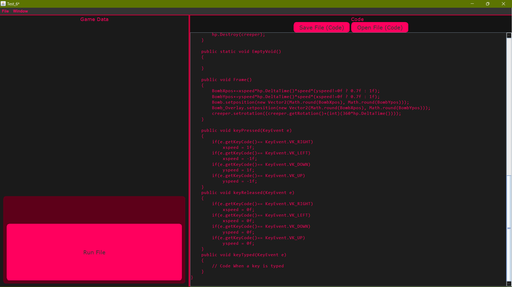
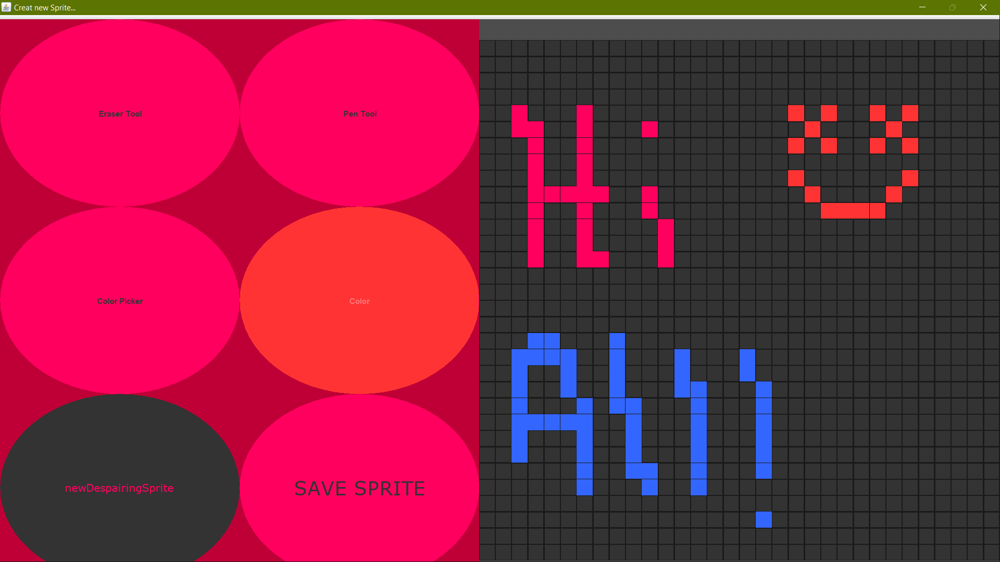
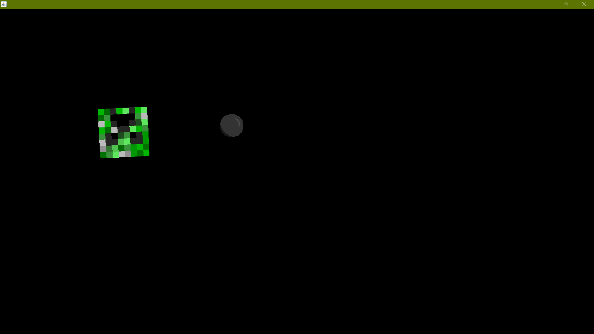

# Hopeless2D
This is my game engine that I made from scratch using java...
> For better documentation: https://vivaanmalik.github.io/Hopeless2D/
## Features
#### This includes:
####     Collision system
####     Sprite Creation (PixelArt) and Render
####     Keyboard Inputs
####     Delta Time
####     Code Editor
  
## Pictures 
  


  
## How I feel after doing this
Kill me. Now.
## Documentation
  
##### The default name of the your .java file will be ```Main.java```, which u cannot change as the name for files aren't project-specefic.  

#### Useful Hopeless2D methods  
  
```run()```                Starts game... put in setup() method  
```Instantiate(Entity)```  Instantiates an Entity in the game window  
```Destroy(Entity)```      Removes and Entity from the game window  
```SetFrameRate(int)```    Sets target frames per second  
```Log(String)```          Log text for debugging  
```String ProjectPath()``` Returns the project path to use for paths on computer  
```float DeltaTime()```    Time in seconds between 2 frames  
  
#### Using Other Classes  
##### Vector2  
  
```Vector2()```  
```Vector2(int x, int y)```  
  
```x()``` returns value x  
```y()``` returns value y  

##### color  
  
```color(int rgb, boolean isSameValue)```  
```color(int R, int G, int B)```  
```color(int R, int G, int B, int A)```  
  
```r()``` returns red value  
```g()``` returns green value  
```b()``` returns blue value  
```a()``` returns alpha value  
  
##### PixelImage  
  
```PixelImage(int x, int y)```  
```PixelImage(color[][] PixelColorData)```  

```SetPixel(int x, int y, color col)``` set pixel at x, y to color col  
```color GetPixel(int x, int y)``` returns value at x, y  
```Vector2 GetDimension()``` returns the dimension (x, y)  
  
##### Entity    
  
```Entity(PixelImage Sprite, Vector2 size, Vector2 pos, int rot, boolean enablecollision)```  
```Entity(PixelImage[] Sprite, Vector2 size, Vector2 pos, int rot, boolean enablecollision)```  
```Entity(BufferedImage[] images, Vector2 size, Vector2 pos, int rot, boolean enablecollision)```  
  
```OnCollide(String)``` Runs method if object is collided... Runs the given method, in Main.java. And sends the name of the colliding object. 
```SetName(String)``` Sets the name of the Entity  
```boolean iscollidable()``` returns boolean, whether or not the entity is using collision physics  
```int getRotation()``` returns rotation of Entity (clockwise) in degress 
```int getImageIndex()``` returns the image index
```Vector2 getposition()``` returns entity position  
```Vector2 getoffsetposition()``` returns offset position due to rotation on object  
```PixelImage[] getSprite()``` returns sprites in array of PixelImage  
```Vector2 getSize()``` returns entity size  
```setposition(Vector2)``` set position of entity  
```setrotation(int)``` set rotation of entity (clockwise) 
```setImageIndex(int index)``` sets the image index to render
```setSprites(PixelImage[])``` set sprites of entity  
```setSize(Vector2)``` set size of enitity  
```GetImage(int)``` returns an Image of sprite from the array based on paramter index
  
#### Default methods in Main.java  
  
```setup()``` Runs at the start of the game  
```Frame()``` Runs every frame  
```keyPressed(KeyEvent e)``` Runs every time a key is pressed  
```keyReleased(KeyEvent e)``` Runs every time a key is released  
```keyTyped(KeyEvent e)``` Runs every time a key is typed
  
#### Example code
  
``` java
import javax.imageio.ImageIO;
import java.awt.image.BufferedImage;
import java.io.File;
import java.io.IOException;
import java.util.Vector;
import java.awt.MouseInfo;
import java.awt.Point;
import Hopeless2D.*;
import java.awt.event.KeyEvent;

public class Main
{
    public static Hopeless hp;
    Entity Bomb;
    Entity Bomb_Overlay;
    static Entity creeper;
    Entity bg;
    float BombXpos = 0f;
    float BombYpos = 0f;
    float xspeed = 0f;
    float yspeed = 0f;
    float speed = 200f;

    public void setup()
    {
        color[][] cols = {{new color(0, true)}};
        bg = new Entity(new PixelImage(cols), new Vector2(1920, 1080), new Vector2(0, 0), 0, false);
        BufferedImage tmp = (BufferedImage) bg.GetImage(0);
        // Test.Log(String.valueOf((tmp.getRGB(0, 0) >> 16) & 0xFF));
        Bomb = new Entity(new PixelImage(cols), new Vector2(64, 64), new Vector2(0, 0), 0, true);
        Bomb_Overlay = new Entity(new PixelImage(cols), new Vector2(64, 64), new Vector2(0, 0), 0, false);
        hp.SetFrameRate(30); // Define the amount of FPS
        try
        {
            BufferedImage[] imgs = {ImageIO.read(new File(hp.ProjectPath()+"\\Bomb_1.png"))};
            Bomb = new Entity(imgs, new Vector2(64, 64), new Vector2(0, 0), 0, true);
            Bomb.SetName("Bomb");
            Bomb.OnCollide("EmptyVoid");
            BufferedImage[] overlayimgs = {ImageIO.read(new File(hp.ProjectPath()+"\\Overlay.png"))};
            Bomb_Overlay = new Entity(overlayimgs, new Vector2(64, 64), new Vector2(0, 0), 0, false);
            BufferedImage[] Creeperimgs = {ImageIO.read(new File(hp.ProjectPath()+"\\CREEP.jpg"))};
            creeper = new Entity(Creeperimgs, new Vector2(128, 128), new Vector2(256, 256), 0, true);
            creeper.SetName("Creeper");
            creeper.OnCollide("CreeperCollide");
        }
        catch (IOException e)
        {
            hp.Log(e.getMessage());
        }
        hp.Instantiate(bg);
        hp.Instantiate(Bomb);
        hp.Instantiate(Bomb_Overlay);
        hp.Instantiate(creeper);
        hp.run(); // Start game ;)
    }

    public static void CreeperCollide()
    {
        hp.Destroy(creeper);
    }

    public static void EmptyVoid()
    {

    }

    public void Frame()
    {
        BombXpos+=xspeed*hp.DeltaTime()*speed*(yspeed!=0f ? 0.7f : 1f);
        BombYpos+=yspeed*hp.DeltaTime()*speed*(xspeed!=0f ? 0.7f : 1f);
        Bomb.setposition(new Vector2(Math.round(BombXpos), Math.round(BombYpos)));
        Bomb_Overlay.setposition(new Vector2(Math.round(BombXpos), Math.round(BombYpos)));
        creeper.setrotation((creeper.getRotation()+(int)(360*hp.DeltaTime())));
    }

    public void keyPressed(KeyEvent e)    
    {
        if(e.getKeyCode()== KeyEvent.VK_RIGHT)
            xspeed = 1f;
        if(e.getKeyCode()== KeyEvent.VK_LEFT)
            xspeed = -1f;
        if(e.getKeyCode()== KeyEvent.VK_DOWN)
            yspeed = 1f;
        if(e.getKeyCode()== KeyEvent.VK_UP)
            yspeed = -1f;
    }
    public void keyReleased(KeyEvent e)
    {
        if(e.getKeyCode()== KeyEvent.VK_RIGHT)
            xspeed = 0f;
        if(e.getKeyCode()== KeyEvent.VK_LEFT)
            xspeed = 0f;
        if(e.getKeyCode()== KeyEvent.VK_DOWN)
            yspeed = 0f;
        if(e.getKeyCode()== KeyEvent.VK_UP)
            yspeed = 0f;
    }
    public void keyTyped(KeyEvent e)
    {        
        // Code When a key is typed
    }
}
```
